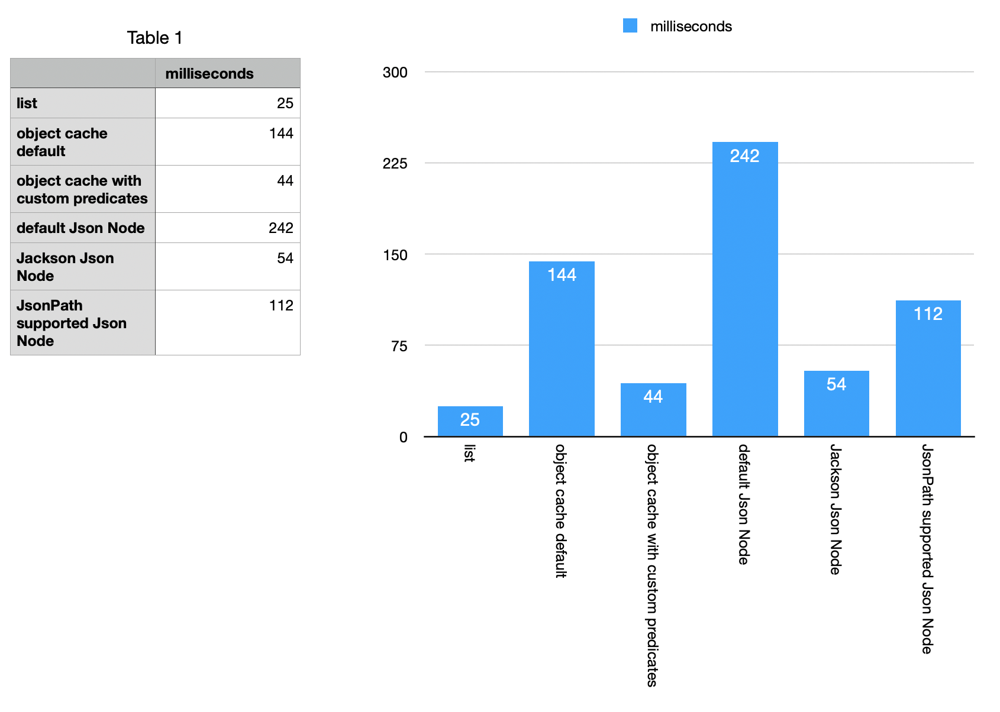
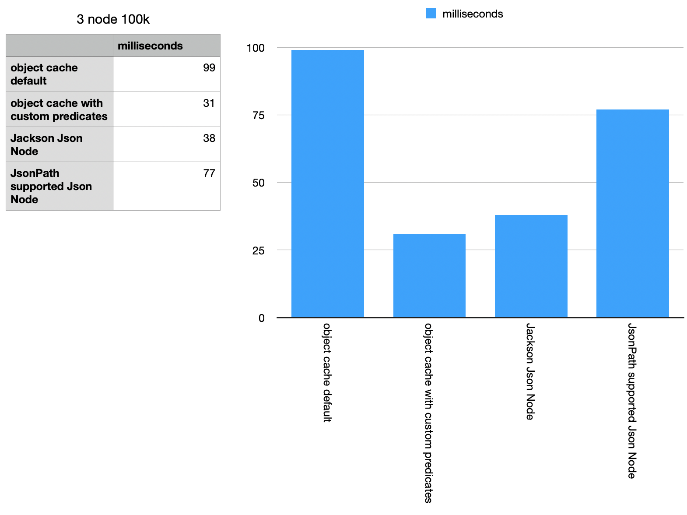
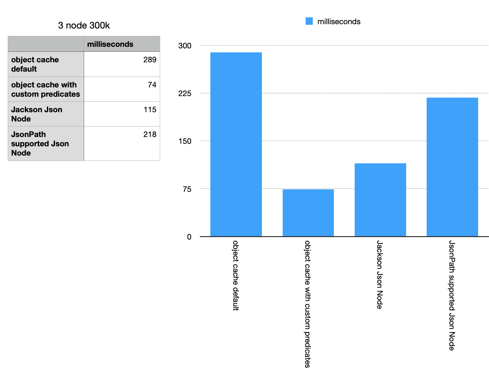

testing Hazelcast with different configurations
---

This project is a test of Hazelcast with different configurations.
There is a Medium article that explains the results of this test.
https://medium.com/@kgignatyev/hazelcast-performance-for-distributed-search-889636f4106f


# Run Multiple instances to form a cluster

Run one line per terminal

```bash
sbr -Dspring-boot.run.arguments=--server.port=8080
sbr -Dspring-boot.run.arguments=--server.port=8081
sbr -Dspring-boot.run.arguments=--server.port=8082
```

in one of terminals run commands to execute tests: 

<pre>
enter command: 
  exit 
  generate-data N, 
  test-list 
  test-list-full
  test-object-cache
  test-object-cache-w-custom-predicate
  test-default-json-node-cache 
  test-custom-json-node-cache
  test-flexible-json-node-cache	
</pre>

Example results:
----

Single node summary:

)

3 nodes with 100K dataset summary



3 nodes with 300K dataset summary


